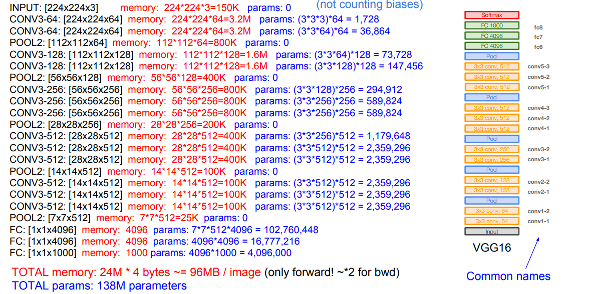
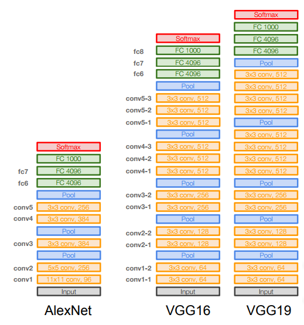
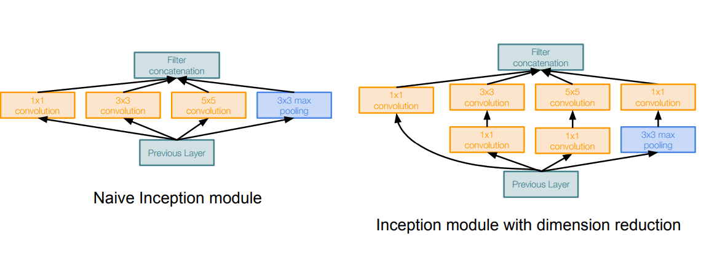
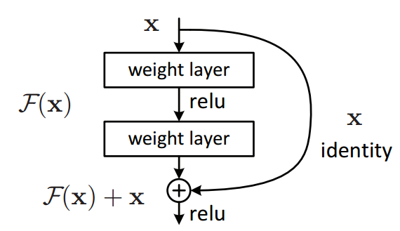

Standford CS231n 2017 Summary

github 地址： **[CS231n 2017](<https://github.com/mbadry1/CS231n-2017-Summary>)** 

## 01. Introduction to CNN for visual recognition

Dataset：

- **Data**： as input
- **Label**： desired(要求的) output
- **Training set**： data and corresponding(相当的) labels

## 02. Image classification

### 1. KNN

> A core task in computer vision: 
>
> - assume(假定) given set of discrete(离散) labels
>
> - an image is just a big grid(方格) of numbers between [0,255]
> - all pixels(像素) change when the camera moves

**challenges**: 

- **illumination(亮度)**
- **deformation(变形)**
- **occlusion(闭塞)**
- **background clutter(背景杂乱)**
- **intraclass variation(同种类别变化)** 
- **viewpoint(视角)**

machine learning: **Data-Driven approach(临近)**

- collect a dataset of images and labels
- use machine learning to train a classifier
- evaluate(评估) the classifier on new images

**The image classification pipeline**: 

- **Input**: our input consists of a set of N images, each labeled with one of K different classes. we refer to this data as the **training set**.
- **Learning**: our task is to use the training set to learn what every one of the classes looks like. we refer to this step as training a **classifier** or learning a **model**. 
- **Evaluation**: we evaluation th quality of the classifier by asking it to predict labels for a new set of images that it has never seen brefore, this new set usually called **testing set**. we compare the true labels of these images(while we call the **ground truth**)

**Hyperparameters** of **KNN(K-Nearest Neighbors)** are: **k and the distance measure(测量)** 

- **K** is the number of neighbors(邻元素)

- **Distance measures** include:  （Best for coordinate(同等的) points）

  - **L2 distance** (Euclidean(欧几里得) distance)

    > $d_2(I_1,I_2) = \sqrt{\sum_p (I_1^p - I_2^p)^2}$ 

  - **L1 distance** (Manhattan(曼哈顿) distance)

    > $d_1(I_1,I_2) = \sum_p |I_1^p - I_2^p|​$ 
    >
    > 
    >
    > 代码： 
    >
    > 


**Setting Hyperparameters**: 


> How to use a dataset: 
>
> - split your training set into **training set** and validation set
> - use **validation set** to tune all hyperparameters
> - run on the **test set** and report performance

**KNN's type**: 

- In image classification we start with a training set of images and labels, and must predict labels on the test set 

- The K-Nearest Neighbors classifiers predicts labels based on nearest training examples

- **Distance metric and K are hyperparameters**

- choose hyperparameters using the validation set

  > only run on the test set once at the very end

**K-Nearest Neighbors on images never used**: 

- the classifier must remember **all of the training data** and store it for future comparisons with the test data. This is space inefficient(低效) because **dataset may be very large** 
- classifying a test image is expensive since it requires a **comparison to all training images**. 
- distance metrics(度量) on pixels are not informative(有益)

### 2. linear classification


- **Linear SVM(线性支持向量机)** classifier(选择器) is an option(选择) for solving the image classification problem, but the curse of dimensions(规模) makes it stop improving(提高) at some point.
- **Logistic regression(逻辑回归)** is a also a solution for image classification problem, but image classification problem is non linear!

 


==Lecture3 P27== 

## 03. Loss function and optimization

### 1. Loss function

> - **loss function**: quantify(量化) our unhappiness with the scores(分数) across the training data
> - **optimization**: come up(提高) with a way of efficiently finding the parameters that minimize the loss function

**loss function**:  

- **SVM loss function**:   

  > -  **$L = \frac{1}{N} \sum_i L_i(f(x_i,W),y_i)$** 
  >
  > - $$L_i = \sum_{j \neq y_i} \begin{cases} 0, & \text if \ s_{y_i} \geq s_j + 1 \\ s_j - s_{y_i} + 1, & \text otherwise \end{cases} = \sum_{j \neq y_i} max(0,s_j - s_{y_i} + 1)$$ 
  >
  > 
  >
  > **regularization(规则化)**: 
  >
  > 
  >

- **Softmax loss**(multinomial logistic regression(多项式逻辑回归)): 

  > - $L_i = - log P$
  > - $P = \frac{e^s k}{\sum_j e^{s_j}} $ 
  >
  > 

**SVM vs Softmax**:  


### 2. optimization

- **strategy(策略) one**: random search

  > 
  >
  > random W and $\alpha$: **W < -W +  $\alpha​$ W** 
  >
  > 
  >
  > **question: low accurate(精确率)** 

- **strategy two**: Follow the slope(倾斜)

  > **compute the gradient(梯度)** of each parameter we have： 
  >
  > - **Numerical gradient**： 
  >
  >   > note: using the finite(有限) difference approximation(近似值), but the downside(下降趋势) is that approximate(since we have to **pick a small value of $h​$** ,while the true gradient is defined as the **limit as $h​$ --> 0**)
  >
  >   
  >
  >   
  >
  > - **Analytic gradient**: 
  >
  >   > note: analytically(分析) using calculus(微积分), which allows us to derive(源自) a direct formula(公式) for the gradient. but it can be **more error**
  >   >
  >   > **gradient check**: compute the analytic gradient and compare it to the numerical gradient to check the correctness(正确性) of your implementation(实现)
  >   >
  >   > **In practice**: **compute with analytic gradient, but check with numetical grandient**
  >
  > **versus(对比)**: 
  >
  > 
  >
  > **grant descent(梯度下降)**: $W = W - learning\_rate * W\_grad​$ 
  >
  > > - learning_rate is so important hyper parameter you should get the best value of it first of all the hyperparameters.
  > > - stochastic(随机) gradient descent:
  > >   - Instead of using all the date, use a mini batch(一批) of examples (32/64/128 are commonly used) for faster results.
  > >
  > > 

## 04. Introduction to Neural network

### 1. backpropagation

- **Computational graphs(计算图)**: Used to represent(描绘) any function with nodes

  > lead us to use  back-propagation(反向传播)
  >
  > 

- **chain rule(链式法则)**: 

  > suppose $y = f(u)$ and $u = g(x)$: $\frac{dy}{dx} = \frac{dy}{du} * \frac{du}{dx}$ 

- **backpropagation**(反向传播):  Computational graphs + chain rule

  > **compute process**: 
  >
  > 
  >
  > **example 1**: 
  >
  > 
  >
  > 
  >
  > **example 2**: 
  >
  > 
  >
  > 
  >
  > 

- **Modularized implementation(模块化实现)**: forward/ backward API

  > - **forward**: compute result of an opration and save any intermediates(中间型) needed for gradient computation in memory
  > - **backward**: apply the chain rule to compute the gradient of the loss function with respect(方面) to the inputs
  >
  > ```python
  > class MultuplyGate(object):
  >   """
  >   x,y are scalars
  >   """
  >   def forward(x,y):
  >     z = x*y
  >     self.x = x  # Cache
  >     self.y = y	# Cache
  >     # We cache x and y because we know that the derivatives contains them.
  >     return z
  >   def backward(dz):
  >     dx = self.y * dz         #[dz/dx * dL/dz]
  >     dy = self.x * dz         #[dz/dy * dL/dz]
  >     return [dx, dy]
  > ```

### 2. neural network

- code to **define a artificial neuron:** 

  > 

- **neural networks**: without the brain stuff(填充物): 

  > 
  >
  > **2-layer Neural Network**: 
  >
  > 

- **Activation functions**: 

  > - **Sigmoid**: 
  >
  >   > - Sigmoid will(soft) saturate(使充满) and kill gradients
  >   >
  >   > - Sigmoid output are not zero-centered: Didn't produce zero-mean data
  >
  > - **tanh**: 
  >
  >   > **$tanh(x) = \frac{e^x - e^{-x}}{e^x + e^{-x}}$ --> $tanh(x) = 2 sigmoid(2x) - 1$**  
  >   >
  >   > - Tanh will(soft) saturate(使充满) and kill gradients
  >   > - Tanh output are not zero-centered
  >
  > - **ReLU**: $max(0,x)$
  >
  >   > - ReLU convergence(聚合) much faster than sigmoid/tanh functions
  >   > - ReLU can be implemented(实施) by simply thresholding(阙值转换) at zero
  >   > - ReLU units can be fragile(脆的) during training and can "die"(hard saturate)
  >
  > - **Leaky ReLU**: $max(0.1x,x)$ 
  >
  >   > - Leaky ReLU will instead have a small negative slope(倾斜)
  >   > - The slope in the negative region(范围) can be made into a parameter of each neuron
  >   > - However, the consistency of the benefit across tasks is presently unclear
  >
  > - **Maxout**: 
  >
  >   > - Both ReLU and Leaky ReLU are a special case of Maxout
  >   > - Maxout neuron enjoys all the benefits of a ReLU unit(linear regime(制度) of opration, no saturation) and does not have its drawbacks(缺点)
  >   > - But it doubles the numbers of parameter for every single neuron
  >
  > **Suggestions**: 
  >
  > - **Never use Sigmoid**
  > - **non-linearity using ReLU**, but "die"
  > - **concerns "die", using ReLU or Maxout** 
  > - **Expect to work worse than ReLU/Maxout, using tanh** 
  >
  > 

## 05. Convolutional neural networks (CNNs)


- **Convolutional neural network**: 

  > - A CNN arranges(安排) its neurons in 3 dimendions(维): width, height, channel
  >
  >   - **width and height** are size of feature maps(特征图谱)
  >   - **Channel** is feature maps number per layer, sometimes is called width of neural networks
  >
  >   > - NN with lots of layers is called **deep NN**
  >   > - NN with lots of channels per layer is called **fat NN** 

- **convolution layer**: 

  > convolved compute: 
  >
  >  
  >
  > **convulved formula**:  padding(填补), stride(步幅)
  >
  > - **output volume(卷) size**: 
  >
  >   $$\begin{cases} height_{out} = (height_{in} - height_{kernel} + 2 * padding) /stride + 1 \\ width{out} = (width{in} - width{kernel} + 2 * padding) /stride + 1\end{cases}$$ 
  >
  > - **number of parameters in a layer**: 
  >
  >   $$Num_{parameter} = filter_h * filter_w * channel * N$$ 
  >
  >   
  >
  > 
  >
  > 

- **channel**: 

  > - channel of the output volume(卷) is a hyperparameter
  > - It corresponds(符合) to the number of filters of each layer, each learning to look for something different in the input
  >
  > **zero padding**: 
  >
  > 


- **Pooling Layer**:  

  > makes the representations(表示) smaller and more manageable(易管理)
  >
  > - reduce size of feature maps
  > - bring non-linearity to Neural Networks
  > - preserve(保存) scale(规模), transform(改变) and rotation invariant(循环不变) of images
  >
  > 
  >
  > example: 
  >
  > 
  >
  > 

- **Fully Connected Layer**: 

  > 

## 06. Training neural networks I

- **Activation Functions(激活函数)**: 

  > neural works: 
  >
  > 
  >
  > **activation function**: 
  >
  > - **Sigmoid** problem: 
  >
  >   > - saturated(使充满) neurons "kill" gradients
  >   >
  >   > - Sigmoid output are not zero-centered: Didn't produce zero-mean data
  >   > - exp() is a bit compute expensive
  >
  > - **tanh**: 
  >
  >   > - Squashes the numbers between [-1,1]
  >   > - Zero centered(nice)
  >   > - Still big values neurons "kill" the gradients
  >
  > - **ReLU**(Rectified(矫正) linear unit): 
  >
  >   > - Does not saturate
  >   > - Computationally efficient(计算效率)
  >   > - Converges(聚合) much faster than Sigmoid\Tanh
  >   > - More biologically plausible(有道理) than sigmoid
  >   > - problem: **Not zero centered output** 
  >   >
  >   > 
  >
  > - **Leaky ReLU**: 
  >
  >   > - Does not saturate
  >   > - Computationally efficient(计算效率)
  >   > - Converges(聚合) much faster than Sigmoid\Tanh
  >   > - More biologically plausible(有道理) than sigmoid
  >   > - **will not "die"** 
  >
  > - **ELU**: 
  >
  >   > - It has all the benefits of RELU
  >   > - Closer to zero mean outputs and adds some robustness(健壮性) to noise.
  >   > - problem: `exp()` is a bit compute expensive(昂贵)
  >
  > - **Maxout**: 
  >
  >   > - Does not have the basic form of dot product
  >   > - Generalizes RELU and Leaky RELU
  >   > - Doesn't die!
  >   > - Problems: **doubles the number of parameters per neuron** 
  >
  > **In practice:** 
  >
  > - Use RELU. Be careful for your learning rates.
  > - Try out Leaky RELU/Maxout/ELU
  > - Try out tanh but don't expect much.
  > - Don't use sigmoid!
  >
  > 

- **Data Preprocessing(预处理)**: 

  > - Normalize(使标准) the data: Zero centered data
  >
  >   > ```python
  >   > # On of the reasons we do this is because we need data to be between positive and negative and not all the be negative or positive. 
  >   > X -= np.mean(X, axis = 1)
  >   > 
  >   > # Then apply the standard deviation. Hint: in images we don't do this.
  >   > X /= np.std(X, axis = 1)
  >   > ```
  >
  > - Normalize images: 
  >
  >   - Subtract(减去) the mean(平均) image (E.g. Alexnet)
  >
  >     > Mean image shape is the same as the input images
  >
  >   - Subtract per-channel mean
  >
  >     > Means calculate the mean(平均) for each channel of all images. Shape is 3 (3 channels)

- **Weight Initialization**: 

  > What happened when W init is constant(相同): have the same gradient and update
  >
  > - First idea: small random numbers
  >
  >   ```python
  >   # Works OK for small networks but it makes problems with deeper networks!
  >   W = 0.01 * np.random.rand(D, H)
  >   ```
  >
  >   ***Xavier initialization***: $W = np.random.rand(in, out) / np.sqrt(in)$ 
  >
  >   > - It works because we want the variance(不一致) of the input to be as the variance of the output.
  >   > - But it has an issue(问题), It breaks when you are using ReLU
  >
  >   ***He initialization*** (Solution for the RELU issue): $W = np.random.rand(in, out) / np.sqrt(in/2)$ 
  >
  >   > Solves the issue with RELU. Its recommended when you are using RELU
  >
  > **Proper initialization is an active area of research**. ==？？== 

- **Batch(批) Normalization**: 

  > 1. compute the empirical mean and variance independently for each dimension
  > 2. Normalize: $\hat{x}^{(k)} = \frac{x^{(k)} - E[x^{(k)}]}{\sqrt{Var[x^{(k)}]}}$ 
  >
  > note: **inserted(嵌入) after Fully connected or convolutional layers and before nonlinearity** 
  >
  > 

- **Babysitting the Learning Process**(临时设置学习方法): 

  > 1. Preprocessing(预处理) of data.
  > 2. Choose the architecture(架构)
  > 3. Double check that the loss is reasonable
  > 4. Add regularization(规则化), the loss should go up
  > 5. Disable the regularization again and take a small number of data and try to train the loss and reach zero loss.
  > 6. Take your full training data, and small regularization then try some value of learning rate
  > 7. Do Hyperparameters optimization to get the best hyperparameters values.

- **Hyperparameter Optimization**: 

  > - Try Cross-validation(交叉验证) strategy(策略)
  >   - Run with a few ephocs, and try to optimize the ranges.
  > - Its best to optimize in log space.
  > - Adjust your ranges and try again.
  > - Its better to try random search instead of grid searches (In log space)

## 07. Training neural networks II

**Optimization algorithms**: 

- **stochastic(随机) gradient descent(SGD)**: 

  >  Problems: 
  >
  > - if loss quickly in one direction and slowly in another, you will get very slow progress along shallow dimension, jitter along steep direction
  > - **Local minimum or saddle(承受) points**

- **SGD + momentum(动量)**:

  > 

- **Nestrov momentum**: 

  >  
  >
  > compare: 
  >
  > 
  >
  > code: 
  >
  > ```python
  > dx = compute_gradient(x)
  > old_v = v
  > v = rho * v - learning_rate * dx
  > x+= -rho * old_v + (1+rho) * v
  > ```

- **AdaGrad**: 

  > ```python
  > grad_squared = 0
  > while(True):
  >   dx = compute_gradient(x)
  >   # here is a problem, the grad_squared isn't decayed (gets so large)
  >   grad_squared += dx * dx			
  >   x -= (learning_rate*dx) / (np.sqrt(grad_squared) + 1e-7)
  > ```
  >
  > Question: 
  >
  > 1. What happens with AdaGrad?
  >
  >    > - progress(前进) along "steep(不合理)" direction is damped(阻尼)
  >    > - process along "flat(平直)" direction is accelerated(加速) 
  >
  > 2. What happens to the step size over long time?
  >
  >    > Decay(衰退) to zero

- **RMSProp**

  > ```python
  > grad_squared = 0
  > while(True):
  >   dx = compute_gradient(x)
  >   #Solved AdaGrad Question
  >   grad_squared = decay_rate * grad_squared + (1-grad_squared) * dx * dx  
  >   x -= (learning_rate*dx) / (np.sqrt(grad_squared) + 1e-7)
  > ```
  >
  > note: People uses this instead of AdaGrad

- **Adam**: 

  > 

**compare**: 

 


**Regularization(规则化)**: 

1. **Add term(条款) to loss**

   > 

2. **Dropout(中途退学)** 

   > - In each forward pass, randomly set some of the neurons to zero. Probability of dropping is a hyperparameter that are 0.5 for almost cases.
   >
   >   > So you will chooses some activation and makes them zero
   >
   >  

3. **Test time**: 

   > 

4. **A common pattern**: 

   > 

5. **Data augmentation(增加)**:

   > - Training: Sample random crops and scales:
   >   1. Pick random L in range [256,480]
   >   2. Resize training image, short side = L
   >   3. Sample random 224x244 patch.
   > - Testing: average a fixed set of crops
   >   1. Resize image at 5 scales: {224, 256, 384, 480, 640}
   >   2. For each size, use 10 224x224 crops: 4 corners + center + flips
   > - Apply Color jitter or PCA
   > - Translation, rotation, stretching.

6. **Transfer learning**: 

   > steps: 
   >
   > 1. Train on a **big dataset** that has common features with your dataset. Called pretraining.
   > 2. Freeze the layers except the last layer and feed your **small dataset** to learn only the last layer.
   > 3. Not only the last layer maybe trained again, you can fine tune any number of layers you want based on **bigger dataset**
   >
   > 
   >
   > |                         | Very Similar dataset               | very different dataset                                       |
   > | ----------------------- | ---------------------------------- | ------------------------------------------------------------ |
   > | **very little dataset** | Use Linear classifier on top layer | You're in trouble.. Try linear classifier from different stages |
   > | **quite a lot of data** | Finetune a few layers              | Finetune a large layers                                      |

## 08. CNN architectures

> These architectures includes: [AlexNet](https://papers.nips.cc/paper/4824-imagenet-classification-with-deep-convolutional-neural-networks.pdf), [VGG](https://arxiv.org/abs/1409.1556), [GoogLeNet](https://research.google.com/pubs/pub43022.html), and [ResNet](https://arxiv.org/abs/1512.03385).

- The first ConvNet that was made was [LeNet-5](http://ieeexplore.ieee.org/document/726791/) architectures: 

  >  

- [**AlexNet**](https://papers.nips.cc/paper/4824-imagenet-classification-with-deep-convolutional-neural-networks.pdf): 

  > input is **227 x 227 x3**: 
  >
  > - layer 1:  **CONV1** (**96 11 x 11** filters at stride 4, pad 0)
  >
  >   > Output shape `(55,55,96) --> (227 -11)/4 + 1 = 55` 
  >   >
  >   > Number of weights are `(11*11*3*96)+96 = 34944` 
  >
  > - layer 2:  **POOL1 (3 x 3** filters applied at stride 2)
  >
  >   > Output shape `(27,27,96) --> (55-3)/2 + 1 = 27` 
  >   >
  >   > No Weights
  >
  > 
  >
  > 

- [**ZFNet**](https://arxiv.org/abs/1311.2901): 

  > 

- [**VGGNet**](https://arxiv.org/pdf/1409.1556): 

  > - 3 (3 x 3) filters has the same effect as 7 x 7
  >
  >   > 
  >
  > 
  >
  > 

- [**GoogleNet**](https://research.google.com/pubs/pub43022.html): 

  > 
  >
  > 

- [**ResNet**](https://arxiv.org/abs/1512.03385): 

  > 

## 09. Object Detection and Segmentation I


- **Semantic Segmentation(语义分割)**: 

  > - Label each pixel in the image with a category(种类) label
  > - Don't differentiate(区别) instances(实例), only care about pixels
  >
  > 

**Transpose(调换) Convolution**: 


**2.5 Zero Padding vs Odd(奇数) 2.5 Zero Padding**: 


**Semantic Segmentation： Fully Convolutional** 


**R-CNN**: 


## 10. Object Detection and Segmentation II